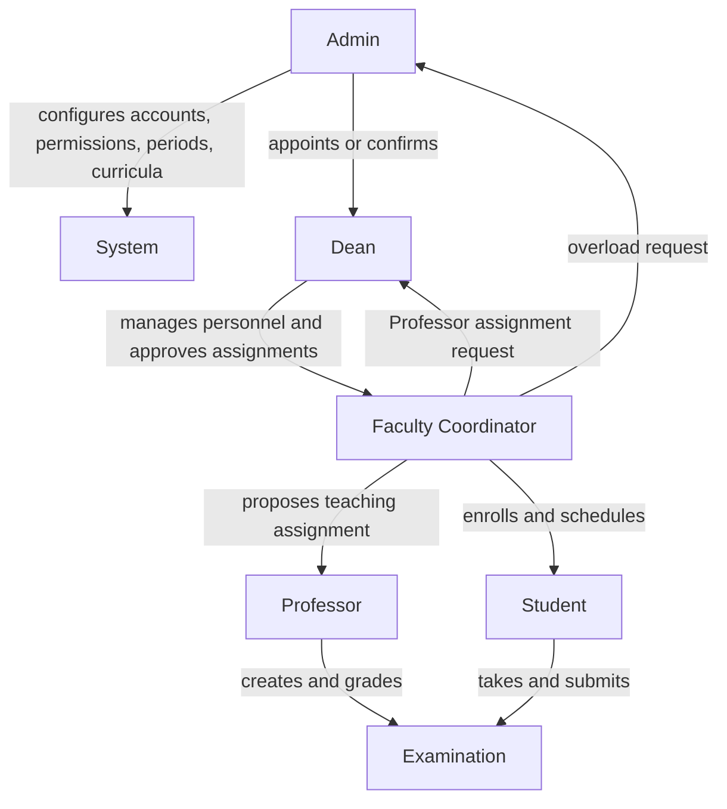
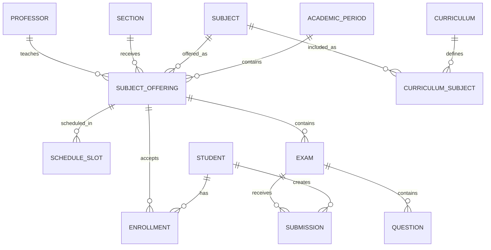

# System Relationship Overview

This document shows how the planned records and workflows relate. It is a conceptual guide, not a final database schema.

## Organizational relationship



## Academic record relationship



## Core records

- **Account:** Authentication, role, status, and permission reference. Belongs to a person and role.
- **Academic period:** School year, term, dates, and lifecycle state. Contains active offerings and enrollments.
- **Curriculum:** Versioned program plan through graduation. Contains Subjects grouped by year and term.
- **Subject:** Reusable academic definition. Appears in curricula and Subject offerings.
- **Section:** Student group for a program and year. Receives Subject offerings.
- **Subject offering:** Actual scheduled class. Connects a period, Subject, Section, and Professor.
- **Schedule slot:** Day and start/end time. Belongs to one Subject offering.
- **Enrollment:** Student membership in an offering. Used for load and examination eligibility.
- **Approval request:** Proposed controlled action and decision. Links the requester, reviewer, target, and status.
- **Audit event:** Append-only record of important activity. Links the actor, action, target, and changes.

## Professor assignment flow

```text
Faculty Coordinator selects an offering and Professor
→ system checks load and schedule conflicts
→ request becomes Pending
→ Dean approves or rejects with remarks
→ approved assignment becomes active
→ requester and Professor are notified
→ decision and resulting change are logged
```

## Student enrollment and overload flow

```text
Faculty Coordinator selects Student and offering
→ system checks curriculum, capacity, duplicate enrollment, load, and schedule
→ within limit: enrollment becomes active
→ above limit: overload request becomes Pending
→ Admin approves or rejects with remarks
→ approved enrollment becomes active
→ decision and resulting change are logged
```

## Academic-period rollover

```text
Active period
→ Admin reviews warnings and confirms closing
→ active offerings, enrollments, schedules, exams, and results become historical
→ records remain readable and reportable
→ selected curriculum may be copied into the new period
→ new period begins without deleting previous data
```

## Schedule conflict rule

Two schedule slots conflict when they occur in the same academic period, share at least one weekday, and their time intervals overlap. Validate conflicts for the Professor, Student, Section, and Room when rooms are enabled.

Adjacent schedules where one ends exactly when another begins are allowed by default.
