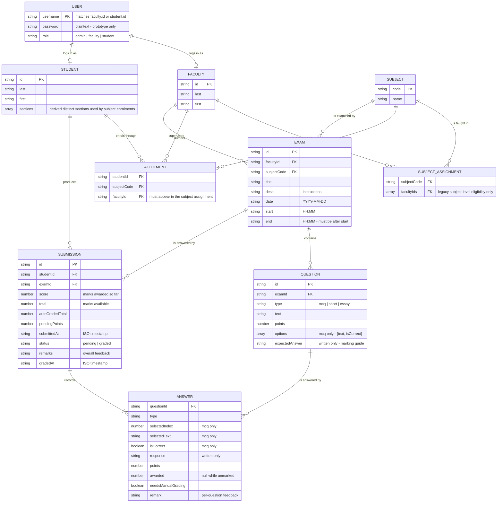

# Data Model and ERD

Covers the final deliverable *"ERD covering all implemented relationships"*.

The prototype's data layer is browser `localStorage`. Each key below holds a JSON
array, and these arrays behave as the tables of the system. There is no database
engine, so **referential integrity is enforced in application code** rather than
by foreign keys — see *Integrity rules* at the end.

Every field listed here was read from the implementation, not designed on paper.

## Entity relationship diagram

## Storage keys

| Key | Holds | Written by |
|---|---|---|
| `users` | Login accounts | Admin (create/edit/delete), login seeding |
| `faculty` | Lecturer records | Admin |
| `students` | Student records | Admin |
| `subjects` | Subject catalogue | Admin |
| `subjectAssignments` | Which lecturers teach which subject | Admin |
| `allotments` | Which student takes which subject under which lecturer | Admin, Faculty |
| `exams` | Examination definitions | Faculty |
| `questions` | Questions belonging to exams | Faculty |
| `studentSubmissions` | Submitted answers, marks and feedback | Student (submit), Faculty (mark) |
| `currentUser` | The active session — `{username, role}` only | Login / logout |

`ANSWER` is not a separate key. It is an array embedded inside each submission,
because an answer has no meaning outside the submission that produced it.

## Cardinality notes

- A **subject** may be taught by **more than one lecturer** (`facultyIds` is an array).
- A **student takes a subject once**. The same student cannot be enrolled twice
  on the same subject, even under a different lecturer — that is a transfer, not
  a second enrolment.
- An **exam belongs to exactly one lecturer and one subject**.
- A **student submits an exam at most once.** Re-entry is blocked after submission.
- A **submission contains one answer per question** presented at the time.

## Integrity rules enforced in code

`localStorage` has no foreign keys, so these are enforced by the application:

| Rule | Where |
|---|---|
| Identifiers are unique per entity | `saveItem()` — admin |
| Changing an identifier rewrites every reference to it (assignments, allotments, exams, submissions) and migrates the login | `saveItem()` — admin |
| Deleting a lecturer removes their login, assignments, allotments, exams, questions and submissions | `deleteItem()` — admin |
| Deleting a student removes their login, allotments and submissions | `deleteItem()` — admin |
| Deleting a subject removes its assignment, allotments, exams and questions | `deleteItem()` — admin |
| Deleting an exam removes its questions and submissions | `deleteExam()` — faculty |
| An allotment's lecturer must be assigned to that subject | `saveAllotment()` — admin |
| An exam's subject must be one the lecturer is assigned to | `saveExam()` — faculty |
| `end` must be later than `start` | `saveExam()` — faculty |
| A rating is only derived once every answer is marked | `grading.js` + both dashboards |

## Known limitations

- **Passwords are stored in plaintext** and are readable through the browser's
  developer tools. This is acceptable for a prototype with no server, and is
  listed under *Future enhancements* in the plan as real backend authentication.
- **Data is per-browser.** Two people on different machines do not share records.
- **No audit trail** of who changed what, listed as a future enhancement.
