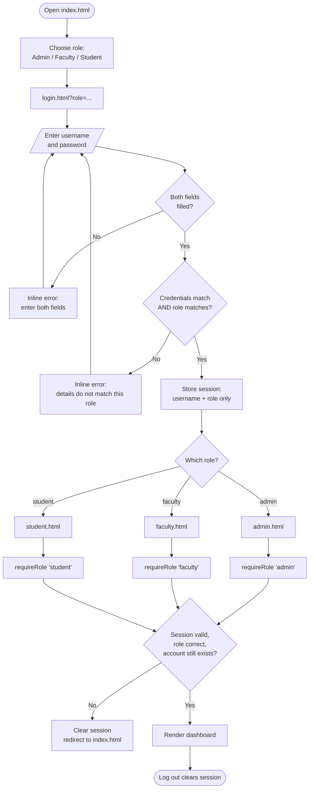
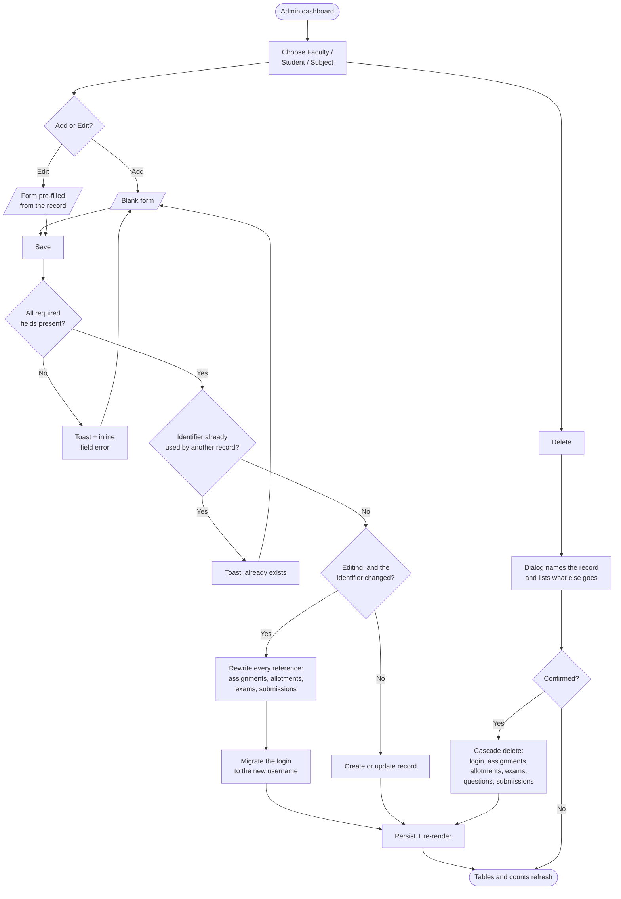
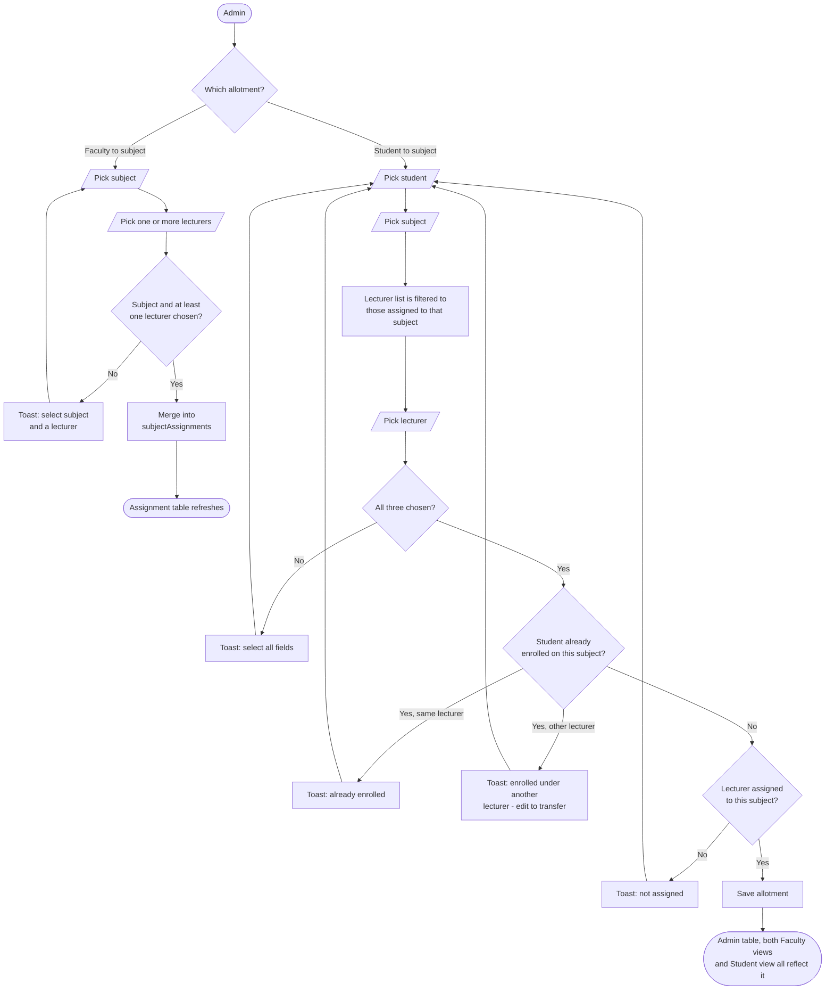
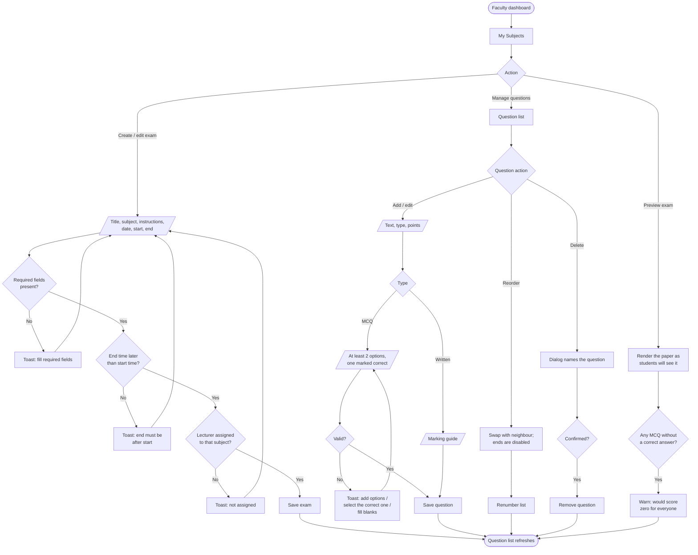
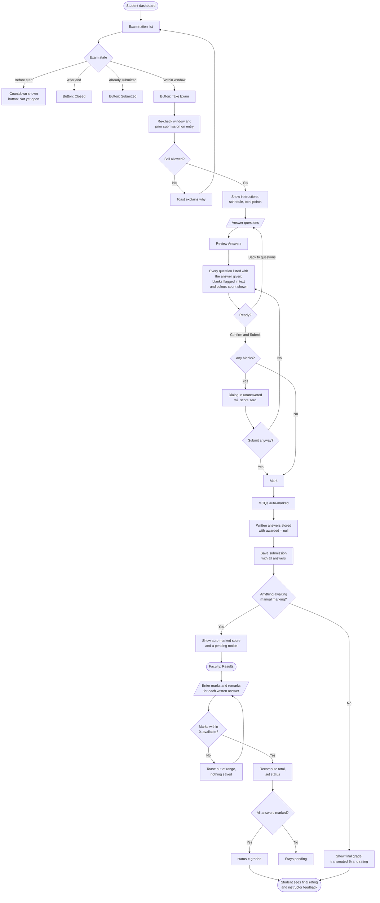
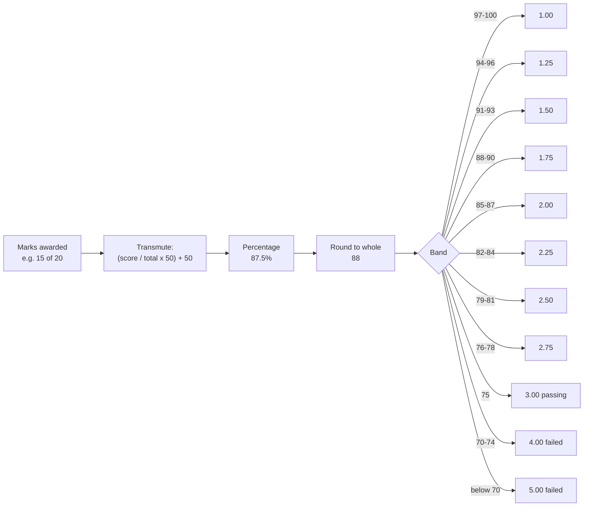

# Flowcharts

Covers the final deliverable *"Main and module-level flowcharts"*.

Each diagram describes the behaviour actually implemented, including the
validation and error paths — not just the happy path.

## Main system flow

The gate at **Q** is the project plan's *"logic gate"*. It runs on every
dashboard load, so a page cannot be reached by typing its URL.

## Module 1 — Faculty and subject creation (Admin)

## Module 2 — Subject allotment (Admin)

## Module 3 — Modifying questions (Faculty)

## Module 4 — Conducting examinations (Student, then Faculty)

## Grading conversion

A blank paper floors at 50%, and exactly half the raw marks reaches the passing
75% / 3.00.
